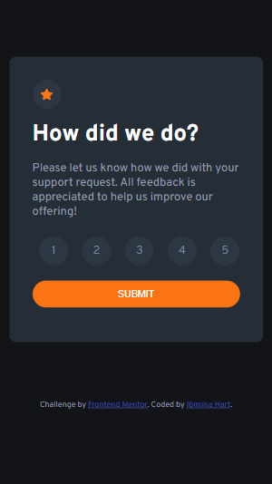
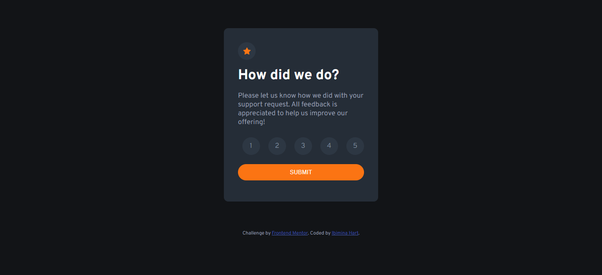

# Frontend Mentor - Interactive rating component solution

This is a solution to the [Interactive rating component challenge on Frontend Mentor](https://www.frontendmentor.io/challenges/interactive-rating-component-koxpeBUmI). Frontend Mentor challenges help you improve your coding skills by building realistic projects. 

## Table of contents

- [Overview](#overview)
  - [The challenge](#the-challenge)
  - [Screenshot](#screenshot)
  - [Links](#links)
- [My process](#my-process)
  - [Built with](#built-with)
  - [What I learned](#what-i-learned)
  - [Continued development](#continued-development)
  - [Useful resources](#useful-resources)


## Overview

### The challenge

Users should be able to:

- View the optimal layout for the app depending on their device's screen size
- See hover states for all interactive elements on the page
- Select and submit a number rating
- See the "Thank you" card state after submitting a rating

### Screenshot





### Links

- Solution URL: [https://github.com/ibimina/ratingcard](https://github.com/ibimina/ratingcard)
- Live Site URL: [https://ibimina.github.io/ratingcard/](https://ibimina.github.io/ratingcard/)

## My process

### Built with

- Semantic HTML5 markup
- CSS custom properties
- Flexbox
- CSS Grid
- Mobile-first workflow


### What I learned


html tag to restyle an input[type="radio"] tag

```html
 <input type="radio" name="options" id="one" value="1">
                <label for="one">1</label>
```

restyling an input[type="radio"] tag
```css
input[type="radio"] {
  -webkit-appearance: none;
  appearance: none;
  -moz-appearance: none;
}

label {
  position: relative;
  display: flex;
  justify-content: center;
  align-items: center;
  width: 40px;
  height: 40px;
  background-color: hsl(213, 19%, 22%);
  border-radius: 50%;
  color: hsl(216, 12%, 54%);
}

 input[type="radio"]:checked+label{
  background-color: hsl(25, 97%, 53%);
  /* transition: 500ms ease ease-in-out; */
color: #fff;
}
```

### Continued development

Use of semantic html

### Useful resources

- [Styling a radio button containing text](https://stackoverflow.com/questions/4641752/css-how-to-style-a-selected-radio-buttons-label) - This helped me in restyle a radio button with containing text. I really liked this pattern and will use it going forward.


## Author

- Frontend Mentor - [@ibimina](https://www.frontendmentor.io/profile/ibimina)
- Twitter - [@ibiminaaH](https://www.twitter.com/ibiminaaH)


